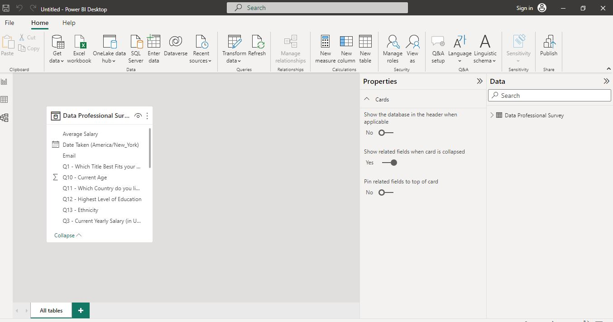
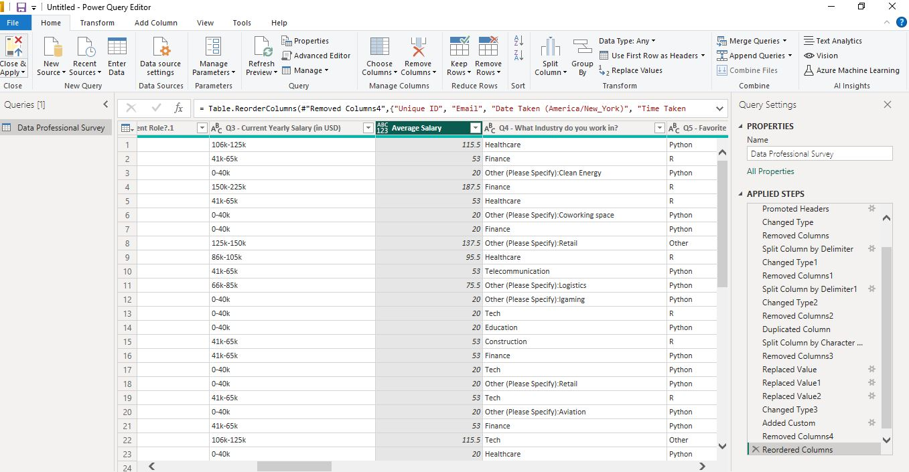
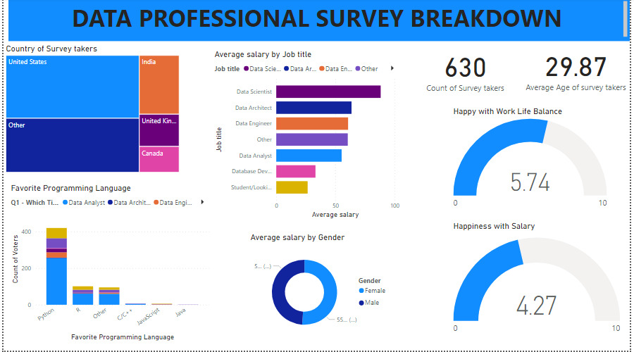

# Power-BI-Project-on-data-professional-survey-takers-

# SONEY GROUP OF COMPANY : Data professional survey takers

This is an Power BI Project on data professional survey takers of an imaginary organization called  **SONEY GROUP OF COMPANY**.  The purpose is to analyze and derive insight to ensue crucial questions are answer and help the company make data driven decision.

**Disclaimer** : All datasets and report do not represent any company, institution or country but a dummy dataset obtain from KPMG virtual internship program to demonstrate compatibility of Excel_

## Problem Statements

1.	What is the total number of survey takers.
2.	What is the average age of survey takers.
3.	What is the average salary of survey takers.
4.	What is the survey takers favorite programming language.
5.	How happy are survey takers with their salary.
6.	How happy are survey takers with work life balance.
7.	Which country has the highest survey takers.

## Data Sourcing

The dataset was obtained on Kaggle, downloaded the excel file and extracted it into power BI for cleaning and visualization.

## Skill and concept demonstrated.

The following power BI features were applied.

•	DAX (custom column, calculated column, 

•	quickmeasure

•	navigation

•	Modelling

•	Filter

•	tooltips

## Data Modelling

Power BI automatically derive data model

## Data Transformation /cleaning

Data was efficiently cleaned and transformed with power Query Editor of Power BI ( a screenshot of the applied steps). Some of the applied steps included are listed below:

Removed all null column.

Split Q1, Q3, Q4, Q5 column by delimiter.

Analytical transform the data to have the idea of average salary as “custom column”

Average salary = ([Q3 Current yearly 1 + Q3 Current Yearly 2])/2

Create a new column as Average column.

Find and replace value on Q3 column.

Data type was changes from “Text” to “whole number”

##  Visualization and analysis

                 

	From the dashboard, it was observe that a total number of 630 people participated in the survey.
   
	The average age of survey takers is approximately 30 years.
   
	Average salary of Data scientist = 93.58K, Data engineer = 65.09, Data architect = 63.67, Database developer = 33.20K, Data analyst = 55.30K, Students = 26.58K, Other = 60.49K
	
	Favorite Programming language is Python.
	
	Happiness with salary is 4.27.
	
  Happiness with work life balance is 5.74.
	
	Country with highest survey takers is USA.

## Conclusion and Recommendation

•	The average age of survey takers is approximately 30 years

•	 Python is the favorite Programming language that most survey takers likes.

•	Happiness with salary of survey takers is 4.27, Salary increment is recommend as 4.27 as happiness with salary is low.

•	USA is the country with highest participant.

•	The number of survey takers that likes C/C++, Javascript and java is low

